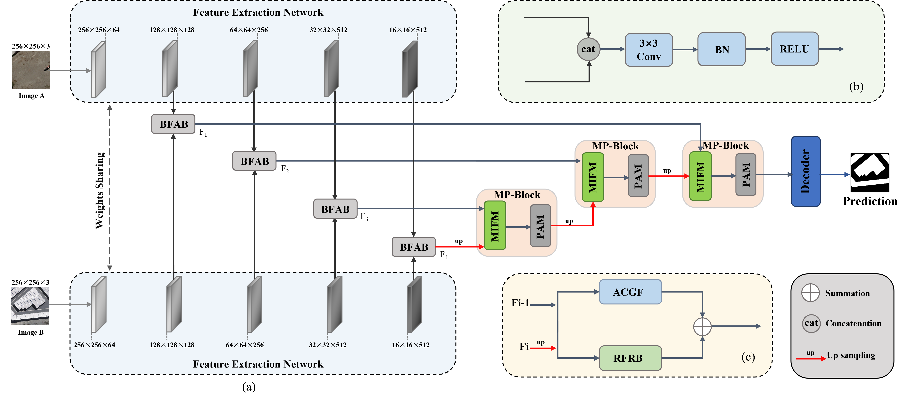
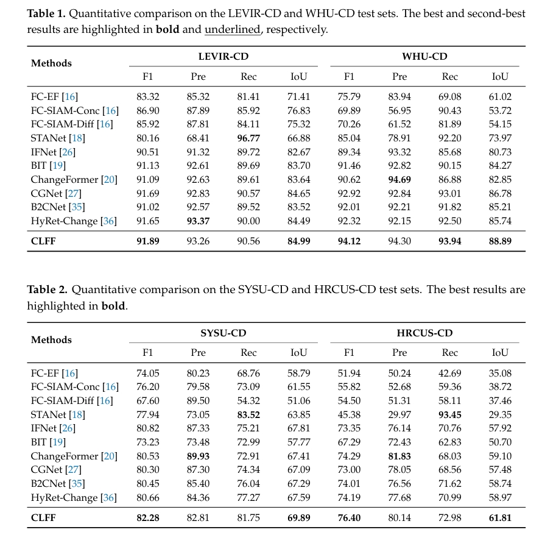

# CFNet: A Change Fusion Network for Inter-layer Feature Integration in Remote Sensing Change Detections
Very High Resolution (VHR) Remote Sensing Change Detection Networks

Methods
-----------------


Quantitative Comparison
-----------------

### :speech_balloon: Dataset Preparation

### :point_right: Data structure

```
"""
Change detection data set with pixel-level binary labels；
├─A
├─B
└─label
"""
```

`A`: images of t1 phase;

`B`: images of t2 phase;

`label`: label maps;
